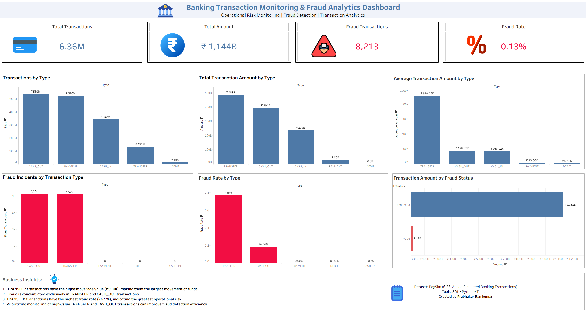
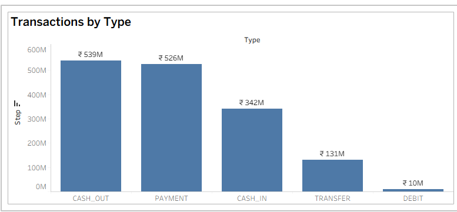
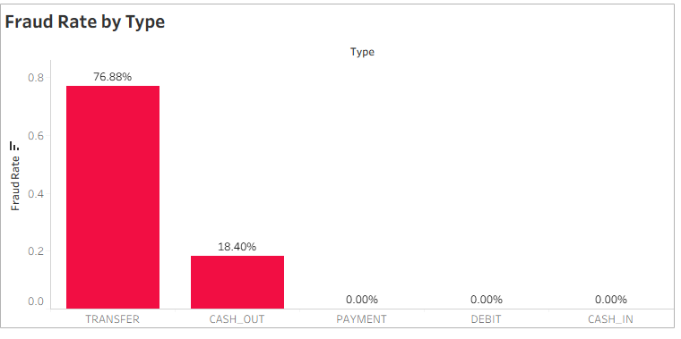
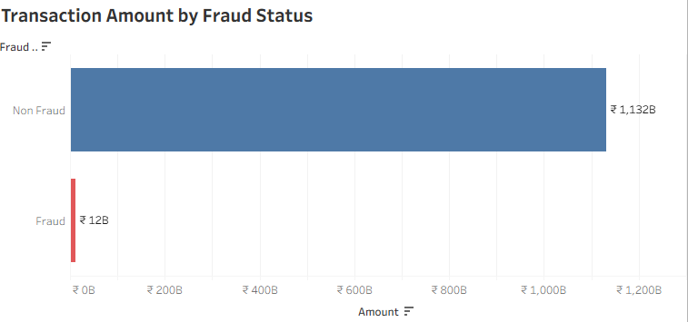
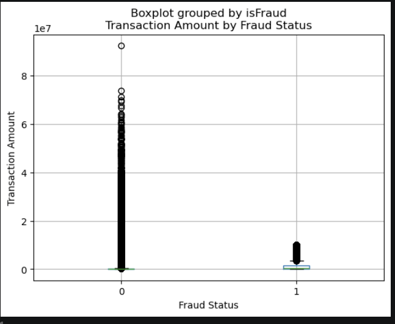
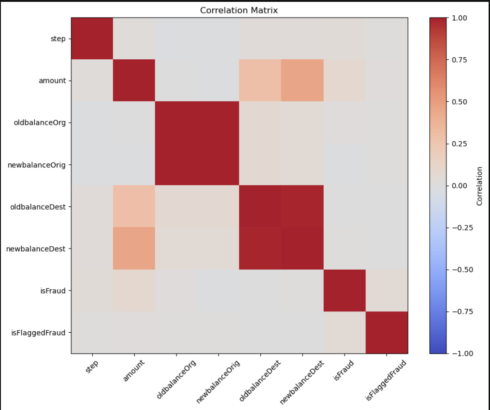

# 🏦 Banking Transaction Monitoring & Fraud Analytics

### SQL | Python | Tableau

An end-to-end Data Analytics project analyzing **6.36 million banking transactions** to uncover fraud patterns, transaction trends, and operational insights. The project combines **SQL** for data querying, **Python** for exploratory data analysis (EDA), and **Tableau** for building an interactive executive dashboard.

---

# 📌 Project Overview

Financial institutions process millions of transactions every day, making fraud detection and transaction monitoring essential for minimizing financial risk.

This project analyzes banking transaction data to identify:

- Fraud patterns
- High-risk transaction types
- High-value transactions
- Transaction trends
- Customer transaction behavior

The analysis is presented through an interactive Tableau dashboard designed for business users and decision-makers.

---

# 🎯 Business Objectives

- Analyze transaction behavior across different transaction types
- Identify fraudulent transaction patterns
- Measure fraud rates across transaction categories
- Detect high-value transactions
- Generate business insights for fraud monitoring
- Build an executive KPI dashboard for operational reporting

---

# 📊 Dashboard Preview




---

# 📂 Dataset Information

**Dataset:** PaySim Mobile Money Transaction Dataset

| Metric | Value |
|---------|--------|
| Total Transactions | 6,362,620 |
| Transaction Types | 5 |
| Fraud Labels | Yes |
| Features | 11 |

### Dataset Columns

- step
- type
- amount
- nameOrig
- oldbalanceOrg
- newbalanceOrig
- nameDest
- oldbalanceDest
- newbalanceDest
- isFraud
- isFlaggedFraud

---

# 🛠 Tech Stack

- SQL (MySQL)
- Python
- Pandas
- Matplotlib
- Tableau Public
- Jupyter Notebook

---

# 📈 Project Workflow

```
Raw Dataset
      │
      ▼
Data Cleaning
      │
      ▼
SQL Analysis
      │
      ▼
Python EDA
      │
      ▼
Business Insights
      │
      ▼
Interactive Tableau Dashboard
```

---

# 🔍 SQL Analysis

The SQL analysis focused on:

- Total transaction volume
- Total transaction value
- Average transaction amount
- Fraud rate analysis
- Transaction type distribution
- High-value transaction identification
- Customer transaction ranking
- Running total analysis using Window Functions

### SQL Concepts Used

- Aggregations
- GROUP BY
- CASE WHEN
- CTEs
- Window Functions
- DENSE_RANK()
- RANK()
- Running Totals
- Subqueries

---

# 🐍 Exploratory Data Analysis (Python)

Python was used for data exploration and visualization to better understand transaction behavior and fraud patterns.

### Visualizations

#### Transaction Type Distribution



---

#### Fraud Rate by Transaction Type



---

#### Fraud Amount Distribution



---

#### Transaction Amount Distribution



---

#### Correlation Heatmap



---

# 📊 Tableau Dashboard

The interactive dashboard provides:

- Executive KPI Cards
- Transaction Type Analysis
- Fraud Rate by Transaction Type
- Fraud vs Legitimate Transaction Comparison
- Transaction Value Distribution
- Interactive Filters
- Dashboard Actions for Drill-down Analysis

Dashboard File:

```
tableau/Banking_Transaction_Fraud_Analytics.twbx
```

---

# 💡 Key Business Insights

- TRANSFER transactions recorded the highest average transaction amount.
- Fraud occurred exclusively in **TRANSFER** and **CASH_OUT** transaction types.
- TRANSFER transactions exhibited the highest fraud rate among all transaction categories.
- Fraudulent transactions involved significantly larger transaction amounts than legitimate transactions.
- Transaction values were highly right-skewed, indicating that a small proportion of transactions accounted for a large share of the total value.

---

# ✅ Business Recommendations

- Enhance monitoring of TRANSFER and CASH_OUT transactions.
- Introduce real-time alerts for high-value transactions.
- Apply additional verification checks for suspicious transaction patterns.
- Continuously monitor fraud KPIs using interactive dashboards.
- Strengthen transaction monitoring using data-driven risk indicators.

---

# 📁 Repository Structure

```
banking-transaction-fraud-analytics/

├── README.md

├── data/
│   ├── raw/
│  
├── sql/
│   ├── 01_data_exploration.sql
│   ├── 02_kpi_analysis.sql
│   ├── 03_transaction_analysis.sql
│   ├── 04_fraud_analysis.sql
│   └── 05_advanced_analysis.sql

├── python/
│   └── Banking_Transaction_Fraud_Analytics.ipynb

├── tableau/
│   ├── Banking_Transaction_Fraud_Analytics.twbx
|   └── Banking_Transaction_Fraud_Analytics.twb

├── images/
│   ├── dashboard.png
│   ├── transaction_type_distribution.png
│   ├── fraud_rate_by_type.png
│   ├── fraud_amount_distribution.png
│   ├── amount_distribution.png
│   └── correlation_heatmap.png
```

---

# 🚀 How to Run

1. Clone the repository.

```
git clone https://github.com/yourusername/banking-transaction-fraud-analytics.git
```

2. Import the dataset into MySQL.

3. Execute SQL scripts from the `sql/` folder.

4. Run the Jupyter Notebook for Python analysis.

5. Open the Tableau workbook (`.twbx`) to explore the interactive dashboard.

---

# 👨‍💻 Author

**Prabhakar Ramkumar**

Data & Reporting Analyst | SQL | Python | Tableau | Power BI
